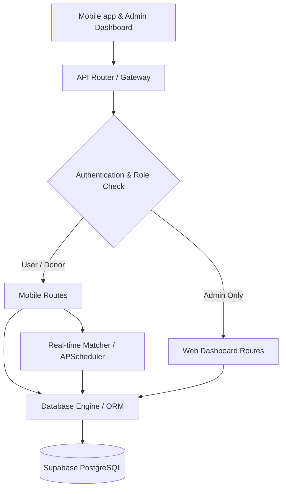

# Amal Blood Donation & Transfer - Technical Implementation Roadmap

This document maps all 14 **User Stories** from [USER_STORIES.md](file:///Users/digitalcenter/Amal/USER_STORIES.md) to their exact technical implementation tasks, database models, handlers, and codebases in the Amal backend.

---

## 🛠️ Roadmap Architecture Overview

---

## 📋 User Story Technical Mapping

### 1. Donor Registration & Blood Type Setup (Story 1)
* **Goal**: Register users and automatically establish donor availability and GPS coordinate mappings.
* **Database Models**: 
  * [User](file:///Users/digitalcenter/Amal/app/models.py#L15) table for credentials.
  * [DonorProfile](file:///Users/digitalcenter/Amal/app/models.py#L57) table storing blood type, availability, and geographic locations.
* **API Handler**: [register](file:///Users/digitalcenter/Amal/app/routes/auth.py#L10) (`POST /api/auth/register`).
* **Implementation Tasks**:
  * [x] Hash user passwords securely via bcrypt inside [auth.py](file:///Users/digitalcenter/Amal/app/auth.py#L19).
  * [x] Verify inputs (ensure `blood_type`, `latitude`, and `longitude` are provided if `is_donor` is true).
  * [x] Automatically create a linked [DonorProfile](file:///Users/digitalcenter/Amal/app/models.py#L57) database record inside a unified atomic database transaction.

---

### 2. Check Donation Eligibility (Story 2)
* **Goal**: Validate that the donor meets the regulatory 56-day (8-week) waiting period threshold before donating.
* **Database Models**: [DonorProfile](file:///Users/digitalcenter/Amal/app/models.py#L57) (`last_donation_date`, `is_available`).
* **API Handler**: [get_donor_profile](file:///Users/digitalcenter/Amal/app/routes/donors.py#L22) (`GET /api/donations/profile`).
* **Implementation Tasks**:
  * [x] Program eligibility validator `is_donor_eligible` inside [scheduler.py](file:///Users/digitalcenter/Amal/app/scheduler.py#L42).
  * [x] Calculate differences between `date.today()` and `last_donation_date`.
  * [x] Block actions if constraints are violated.

---

### 3. Voluntary Appointment Scheduling (Story 3)
* **Goal**: Enable donors to book voluntary slots.
* **Database Models**: [DonationSchedule](file:///Users/digitalcenter/Amal/app/models.py#L116).
* **API Handler**: [schedule_appointment](file:///Users/digitalcenter/Amal/app/routes/donors.py#L38) (`POST /api/donations/schedule`).
* **Implementation Tasks**:
  * [x] Intercept scheduling and confirm the donor doesn't have an active upcoming reservation (`status == "scheduled"`).
  * [x] Validate donor eligibility criteria.
  * [x] Create schedule, link `donor_id`, set `status` to `"scheduled"`, and temporarily update `DonorProfile.is_available` to `False` to prevent double-booking.

---

### 4. Retrieve My Upcoming Appointments (Story 4)
* **Goal**: Allow donors to see active appointments.
* **Database Models**: [DonationSchedule](file:///Users/digitalcenter/Amal/app/models.py#L116) (linked to current donor profile).
* **API Handler**: [get_my_appointments](file:///Users/digitalcenter/Amal/app/routes/donors.py#L30) (`GET /api/donations/my-appointments`).
* **Implementation Tasks**:
  * [x] Extract donor record utilizing the JWT token dependency `get_current_donor_profile` in [donors.py](file:///Users/digitalcenter/Amal/app/routes/donors.py#L10).
  * [x] Query and return database records filtering by `donor_id`.

---

### 5. Create a Blood Request (Story 5)
* **Goal**: Create blood requests and initiate matching.
* **Database Models**: [BloodRequest](file:///Users/digitalcenter/Amal/app/models.py#L87) (storing urgency, location, needed_by date).
* **API Handler**: [create_blood_request](file:///Users/digitalcenter/Amal/app/routes/requests.py#L11) (`POST /api/requests/create`).
* **Implementation Tasks**:
  * [x] Insert the request record into database with status set to `"pending"`.
  * [x] Validate urgency level parameter.
  * [x] If urgency is `"high"` or `"critical"`, trigger immediate database matching in a background thread `run_immediate_matching` in [requests.py](file:///Users/digitalcenter/Amal/app/routes/requests.py#L51).

---

### 6. Track My Requests (Story 6)
* **Goal**: Enable users to track blood request fulfillment.
* **Database Models**: [BloodRequest](file:///Users/digitalcenter/Amal/app/models.py#L87).
* **API Handler**: [get_my_requests](file:///Users/digitalcenter/Amal/app/routes/requests.py#L60) (`GET /api/requests/my-requests`).
* **Implementation Tasks**:
  * [x] Retrieve authenticated user details via JWT token.
  * [x] Query database table returning requests matching `created_by_id`.

---

### 7. Real-Time Compatible Donor Count (Story 7)
* **Goal**: Provide instant feedback on nearby matching donors.
* **Database Models**: [BloodRequest](file:///Users/digitalcenter/Amal/app/models.py#L87) and [DonorProfile](file:///Users/digitalcenter/Amal/app/models.py#L57).
* **API Handler**: [get_eligible_donors_count_for_request](file:///Users/digitalcenter/Amal/app/routes/requests.py#L69) (`GET /api/requests/{request_id}/eligible-donors-count`).
* **Implementation Tasks**:
  * [x] Verify requester is request owner or system administrator.
  * [x] Run compatibility algorithm filtering active, eligible donors.
  * [x] Compute geo-spatial distances utilizing the Haversine formula and return overall compatibility stats vs. nearby compatible counts (< 30km).

---

### 8. Dashboard Health Indicators (Story 8)
* **Goal**: Summarize active platform metrics for administrators.
* **Database Models**: All tables (`User`, `DonorProfile`, `BloodRequest`, `DonationSchedule`).
* **API Handler**: [get_dashboard_stats](file:///Users/digitalcenter/Amal/app/routes/admin.py#L10) (`GET /api/admin/dashboard`).
* **Implementation Tasks**:
  * [x] Execute count queries grouped by role, availability status, request completion, and appointment results.
  * [x] Enforce administrator authorization using `Depends(get_current_admin)`.

---

### 9. Force Automatic Match Runs (Story 9)
* **Goal**: Trigger the matching algorithm manually on demand.
* **Database Models**: All models.
* **API Handler**: [trigger_auto_scheduling](file:///Users/digitalcenter/Amal/app/routes/admin.py#L67) (`POST /api/admin/schedule/auto`).
* **Implementation Tasks**:
  * [x] Enforce admin privilege security bounds.
  * [x] Execute core matching engine routine `run_auto_scheduling` in [scheduler.py](file:///Users/digitalcenter/Amal/app/scheduler.py#L162).

---

### 10. Manage Appointment Statuses (Story 10)
* **Goal**: Drive the donation schedule lifecycle.
* **Database Models**: [DonationSchedule](file:///Users/digitalcenter/Amal/app/models.py#L116) and [DonorProfile](file:///Users/digitalcenter/Amal/app/models.py#L57).
* **API Handler**: [update_appointment_status](file:///Users/digitalcenter/Amal/app/routes/admin.py#L73) (`PATCH /api/admin/appointments/{appointment_id}`).
* **Implementation Tasks**:
  * [x] Validate transition payload parameter (`completed`, `cancelled`, `no_show`).
  * [x] **If Completed**: Record units donated, update donor profile `last_donation_date` to today, and reset donor `is_available` to `True`.
  * [x] **If Cancelled / No-show**: Return donor profile `is_available` to `True` immediately, and rollback request status if a previously locked match slot is lost.

---

### 11. Emergency Push Notification & 1-Tap RSVP (Story 11)
* **Goal**: Send instant notifications and accept matching reservations.
* **Database Models**: [DonationSchedule](file:///Users/digitalcenter/Amal/app/models.py#L116) and [Invitation](file:///Users/digitalcenter/Amal/app/models.py#L141).
* **API Handler**: [respond_to_invitation](file:///Users/digitalcenter/Amal/app/routes/donors.py#L121) (`POST /api/donations/invitations/{invitation_id}/respond`).
* **Implementation Tasks**:
  * [x] Integrate push notification microservice adapter mock inside [notifications.py](file:///Users/digitalcenter/Amal/app/notifications.py#L7) to alert top 5 closest matched eligible donors.
  * [x] Set a TTL (Time-To-Live) cache check inside [scheduler.py](file:///Users/digitalcenter/Amal/app/scheduler.py#L295) for matching invitations. If donor doesn't confirm within 180 seconds, expire and cascade to next donor.

---

### 12. Mobile Pre-Screening Questionnaire (Story 12)
* **Goal**: Conduct pre-screen checkups on user phones to eliminate walk-in clinic rejection rates.
* **Database Models**: [DonorProfile](file:///Users/digitalcenter/Amal/app/models.py#L57) (with `health_clearance_token` and `health_checked_at` fields).
* **API Handler**: [submit_pre_screen_questionnaire](file:///Users/digitalcenter/Amal/app/routes/donors.py#L246) (`POST /api/donations/profile/pre-screen`).
* **Implementation Tasks**:
  * [x] Add database storage fields to [DonorProfileBase](file:///Users/digitalcenter/Amal/app/models.py#L50) schema to log clearance tokens and checking times.
  * [x] Implement screening route logic checking questionnaire responses in [donors.py](file:///Users/digitalcenter/Amal/app/routes/donors.py#L246). If any risk is flagged, eligibility is blocked and donor availability set to `False`.

---

### 13. Emergency Pass & Navigation Route Guidance (Story 13)
* **Goal**: Offer live GPS navigation routes and priority passes inside the donor mobile app.
* **Database Models**: [DonationSchedule](file:///Users/digitalcenter/Amal/app/models.py#L116) linked to [BloodRequest](file:///Users/digitalcenter/Amal/app/models.py#L87).
* **API Handler**: `GET /api/donations/my-appointments` (providing GPS details).
* **Implementation Tasks**:
  * [ ] Expose target hospital coordinates (latitude, longitude) inside the schedule responses.
  * [ ] Generate a cryptographic JWT priority token (acting as the Emergency Priority Pass) which when scanned verify appointment authenticity.

---

### 14. Digital QR Code Fast-Track Check-In (Story 14)
* **Goal**: Check in verified donors instantly using QR code scanning at the blood bank desk.
* **Database Models**: [DonationSchedule](file:///Users/digitalcenter/Amal/app/models.py#L116).
* **API Handler**: `PATCH /api/admin/appointments/{appointment_id}/check-in` (transitioning status to `"arrived"`).
* **Implementation Tasks**:
  * [ ] Create check-in API route that verifies the scanned token, checks pre-screening pass values, and transitions schedule status to `"arrived"`.
